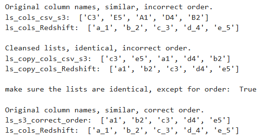

# python-list-reorder
Playbook to reorder 2 lists (e.g. for loading CSV file in S3 into AWS Redshift table)

Python lists are ordered.  Situation where two Python lists are identical contents except for order.

How to reorder one Python list, so that it exactly matches the other order.  

Specifically came across this problem when trying to load a CSV file from S3 into Redshift.  
1. The order of the columns in CSV were different than column order in Redshift.
1. The CSV header names in S3 were slightly different than the column names in Redshift.  

Here is the output of the script in this repo:

References: 
* https://stackoverflow.com/questions/29820498/how-to-change-column-ordering-in-amazon-redshift
* https://docs.aws.amazon.com/redshift/latest/dg/r_COPY_command_examples.html
* https://docs.aws.amazon.com/redshift/latest/dg/r_COPY.html

